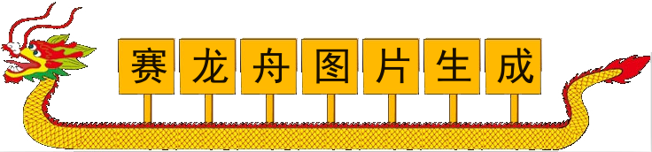

# 应用一览

## 小人举牌图片生成

- 链接：[**主线路**](//jump.srv.tcapps.twocola.com?p=HoldUpSign)
- 集群： `多线路`
  - [1.hus.tcapps.twocola.com](//1.hus.tcapps.twocola.com)
  - [2.hus.tcapps.twocola.com](//2.hus.tcapps.twocola.com)
  - [3.hus.tcapps.twocola.com](//3.hus.tcapps.twocola.com)
  - [4.hus.tcapps.twocola.com](//4.hus.tcapps.twocola.com)
  - [5.hus.tcapps.twocola.com](//5.hus.tcapps.twocola.com)
- 限制： `全资源`
- 性质： `免费开源`
- 源码： [GitHub](https://github.com/jokin1999/HoldUpSign)
- 维护： `仅服务`
- 备注： 由于`全资源`限制，无法生成超大型的图片，站点会出现未响应的情况属于正常情况。
- 服务提供： `GearHost`

---

## 赛龙舟图片生成

- 链接： [**主线路**](//jump.srv.tcapps.twocola.com?p=Dragon)
- 集群： `多线路`
  - [1.slz.tcapps.twocola.com](//1.slz.tcapps.twocola.com)
  - [2.slz.tcapps.twocola.com](//2.slz.tcapps.twocola.com)
  - [3.slz.tcapps.twocola.com](//3.slz.tcapps.twocola.com)
  - [4.slz.tcapps.twocola.com](//4.slz.tcapps.twocola.com)
  - [5.slz.tcapps.twocola.com](//5.slz.tcapps.twocola.com)
- 限制： `全资源`
- 性质： `免费开源`
- 源码： [GitHub](https://github.com/jokin1999/HoldUpSign)
- 维护： `仅服务`
- 备注： 由于`全资源`限制，无法生成超大型的图片，站点会出现未响应的情况属于正常情况；此项目需要自行手动换行。
- 服务提供： `GearHost`

---

解释一览

**粗体** ： 均衡服务，使用此类地址可以自动转到最合适的服务器，自动避开不可用服务。

`多线路`： 使用多个服务链路（非多个运营商）。

`全资源限制`： CPU、MEM、BANDWIDTH均被限制，当资源使尽后，无法正常提供服务。
